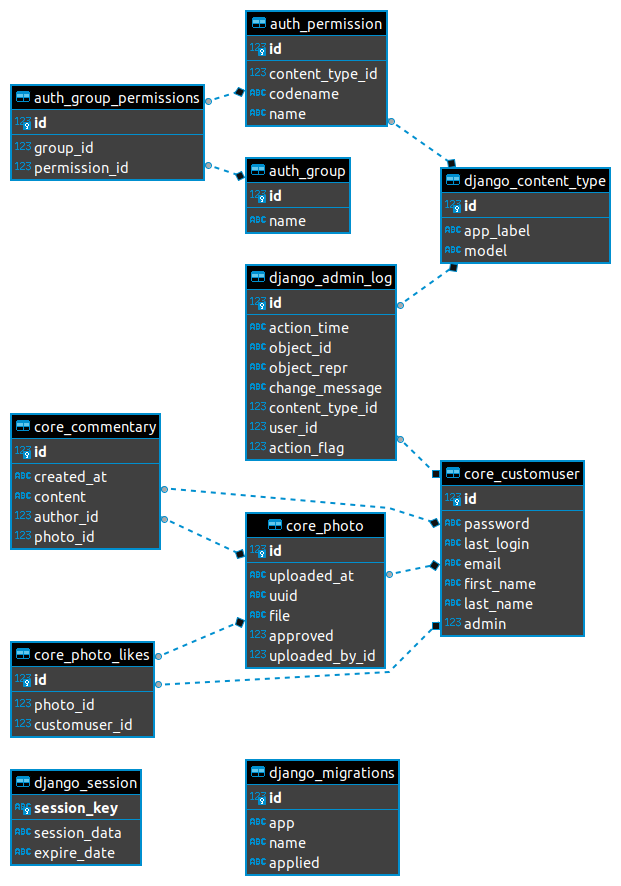

# Wedding Album challenge line of thought

The whole challenge was developed using BDD (Behaviour driven development) specially using the specification by example.

The first action taken was to break the challenge into micro challenges, using a few users stories to guide the development.

All specifications were made with a BDD framework, all scenarios and features created can be found on the path "tests/acceptance/features/" and can be read by anyone, no technical skills required.

It is written in scenarios format using a natural language (Gherkin), which describes actions a user could perform on an application and the expected behaviour for those actions.

The tests written are E2E(End-to-End) tests, this way the application was fully tested. These tests do not exclude the need of unit tests, but they can cover the most of cases. E2E tests could save you some time when developing a MVP to prove a hypothesis.

The backend was written using the web framework Django, which is used by Instagram, an application that looks like the challenge application.

On a production environment the database used is Postgres, for development sqlite works really well.

The project is hosted on heroku and can be accessed through this url https://wedding-album-rvmoura.herokuapp.com/.

# The application structure:
```
├── behave.ini
├── core
│   ├── admin.py
│   ├── apps.py
│   ├── forms.py
│   ├── __init__.py
│   ├── migrations
│   ├── models.py
│   ├── templates
│   ├── urls.py
│   └── views.py
├── main
│   ├── asgi.py
│   ├── __init__.py
│   ├── settings.py
│   ├── urls.py
│   └── wsgi.py
├── manage.py
├── poetry.lock
├── Procfile
├── pyproject.toml
├── README.rst
├── requirements.txt
```

# Database relationships

The core folder is a django app, where the database's models are defined and have the following relationship:



The first model created was the model CustomUser, an extension from AbstractUser from Django.

After this step the model Photo was created, this model has a Foreign Key related to the CustomUser model, which relates the publisher to the photo. This Foreign Key relationship is used in this application context since a user can publish one or more photos, but a photo can only be related to one user.

Then it was added a new relationship between photos and users, this time a Many To Many relationship, used to save the likes from a photo.

The last model from the project is the model Commentary and this table has a Foreign Key to CustomUser to track the author for a comment and a Foreign Key to Photo to relate a comment to a photo.

The other models on the ER Diagram are the default models provided by the framework.

# The tests project structure:
```
└── tests
    └── acceptance
        ├── assets
        │   ├── img
        │   │   └── sokka.jpg
        │   └── pdf
        │       └── sokka.pdf
        ├── environment.py
        ├── features
        │   ├── like_photo.feature
        │   ├── login.feature
        │   ├── logout.feature
        │   ├── photo_approvement.feature
        │   ├── photo_comment.feature
        │   ├── photo_reprovement.feature
        │   ├── register_guests.feature
        │   ├── submit_photo.feature
        │   └── timeline.feature
        ├── helpers
        │   ├── constants.py
        ├── modules
        │   ├── auxiliar.py
        └── steps
            ├── like_photo.py
            ├── login.py
            ├── logout.py
            ├── photo_approvement.py
            ├── photo_comment.py
            ├── register_guests.py
            ├── submit_photo.py
            └── timeline.py
```
Here we have the tests project structure, on the directory assets we find the files used to test the upload.

On the helpers directory we have the constants file, used to keep some constants useds on tests, like  server address, etc.

The file environment is where we setup the hooks from BDD framework.

In modules directory we can create some functions to help us with the tests, the auxiliar module has some methods to cast the given text on Gherkin to Python objects.

On steps we have the automation for tests, like the actions on the application and the asserts to those actions.

Here we have the tests projects structure, where the features directory is where the

# Conclusion

All uploaded files are saved on AWS S3 as required in the challenge.

There are two kinds of users for the application: the admins (the bride and the groom) and common users (guests). All photos uploaded by the users are sent to be approved by the admins before they become available for all users as required in the challenge.


# Improvements
There are some point to be improved on this solution:
 - The upload should send the photo to a queue system to check the file metadata to guarantee the file is  a real picture and reduce the photo size;
 - E2E need some refactor to apply the PageObject design pattern to improve the tests maintenance;
 - The frontend for the application should be developed in a proper framework and considering UX;
 - Django Rest Framework can be added to move some views to API calls;
 - Unit tests on application;
 - Add Docker and Docker-compose to improve environment setup;
